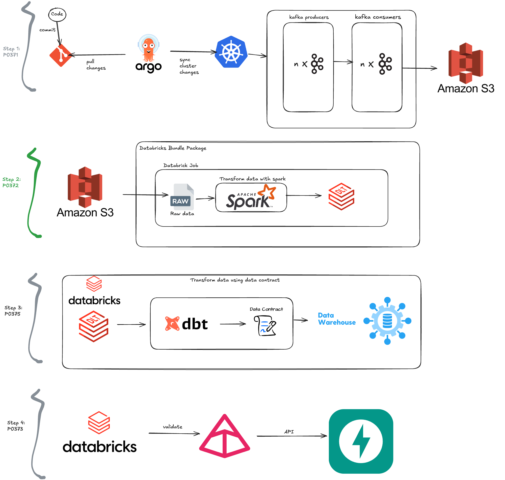

## data cleansing with pandas pipe , polars pipe, Databricks bundle package using pyspark

## Project Summary
This project focuses on data cleansing using various tools and packages such as pandas pipe, polars pipe, and Databricks bundle package. It aims to streamline and automate the data transformation process, ensuring data quality and consistency across different data sources. By leveraging these powerful libraries, the project provides efficient and scalable solutions like pyspark for handling large datasets.

## Project architecture

# todo
- Polars under construction